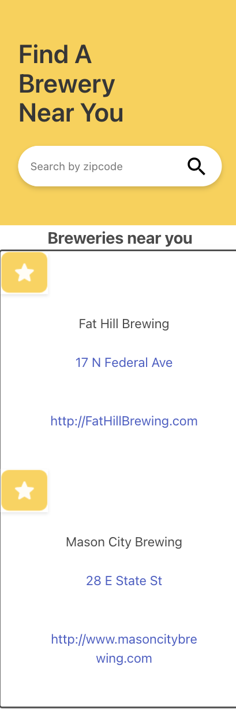

# BeerMe
As a beer lover
I want to search for breweries in my area using zip codes
So that I can quench my thirst with a locally crafted beer

## Criteria
Use a CSS framework other than Bootstrap.

Be deployed to GitHub Pages.

Be interactive (i.e., accept and respond to user input).

Use at least two server-side APIs.

Does not use alerts, confirms, or prompts (use modals).

Use client-side storage to store persistent data.

Be responsive.

Have a polished UI.

Have a clean repository that meets quality coding standards (file structure, naming conventions, follows best practices for class/id naming conventions, indentation, quality comments, etc.).

Have a quality README (with unique name, description, technologies used, screenshot, and link to deployed application).

## Built with 
* HTML
* CSS
* JavaScript
* jQuery API
* Bulma API
* Open Brewery API
* Google Maps API

## Website
https://fpierrerun.github.io/BeerMe/

## Screenshot

## Created by:
    Francis Pierre-Louis

    Justice Page

    Giovanni Claro

    Jason Leitz
